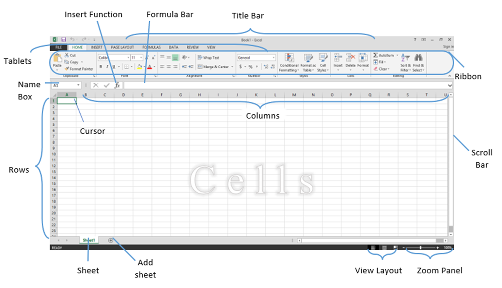

## Productivity Tools (Spreadsheets)

### Introduction

##### Spreadsheet

In the past a spreadsheet was a ledger book full of huge sheets of paper that would quite literally spread across the table. Rows and columns divided these sheets for manually entering data using a pen or pencil. 

Accountants would primarily use these ledger books for a variety of finance-related scenarios that handled a lot of data. A whole spreadsheet could cover aspects such as accounts receivable, investments, inventory and expenses. Everything accountants needed to know was right there in one place, so they could easily make important decisions.

##### Spreadsheet Application 
A spreadsheet program is a software application used primarily for organizing, analyzing, and presenting data in tabular form. It allows users to create tables or grids made up of rows and columns, where they can input data, perform calculations, and generate visual representations like charts or graphs based on the data entered.

Popular spreadsheet programs include Microsoft Excel, Google Sheets, and Apple Numbers. These applications offer various features such as formulas and functions for mathematical calculations, sorting and filtering tools, pivot tables for data summarization, and customizable charts and graphs for data visualization.

Spreadsheets are commonly used in business, finance, accounting, engineering, and many other fields where data manipulation, analysis, and reporting are essential tasks. They provide a flexible and powerful way to work with large sets of data efficiently.

### Microsoft Office Excel

Microsoft Excel is a powerful spreadsheet program developed by Microsoft Corporation. It's part of the Microsoft Office suite of productivity software. Excel is designed to help users create, edit, organize, and analyze data in a tabular format. For this reason it is mostly used by personnel involved in financial account and similar areas.

### Main features of Excel

#### 1. Cells, Rows, and Columns
Data is organized into cells, which are arranged in rows and columns. Users can input text, numbers, formulas, and functions into cells.

#### 2. Formulas and Functions
Excel provides a wide range of mathematical, statistical, logical, and text functions that can be used to perform calculations and manipulate data dynamically.

#### 3. Charts and Graphs
Users can create various types of charts and graphs, such as bar charts, line graphs, pie charts, and more, to visually represent data and trends.

#### 4. Data Analysis Tools
Excel offers tools like pivot tables, data sorting and filtering, conditional formatting, and goal seeking to analyze and interpret data effectively.

#### 5. Data Import and Export
Excel supports importing data from external sources such as databases, CSV files, and other Excel workbooks. It also allows exporting data to different file formats for sharing and collaboration.

### Microsoft Excel Versions 
1. Microsoft Excel 2003
2. Microsoft Excel 2007
3. Microsoft Excel 2010
4. Microsoft Excel 2013
5. Microsoft Excel 2016
6. Microsoft Excel 2019
7. Microsoft Excel 2021

### Uses of Excel

Microsoft Excel is widely used in businesses, academia, finance, accounting, engineering, and various other industries for tasks such as budgeting, data analysis, reporting, project management, and more.

- It is used for entering data i.e. numerical and alphanumerical data.
- It is used for making simple and complex calculations.
- It is used for creating balance sheets for accounting and banking activities.
- It is used as a Database Management System for record keeping.
- It is used for analyzing data
- It is used for creating graphical representations of data.  i.e. Pie charts, Bar chart, etc.
### Parts of an Excel Window

The window below is based on Microsoft Office Excel 2016.

### Uses of the parts of an excel Window.
#### 1. Cell.
This is a field or space formed due to the inter-section of rows and columns. The combinations of all these cells from what is known as a spreadsheets. Cells are spaces in which values are entered in a spreadsheet. There are a total of 1,048,576 rows and there are 16,384 columns in a spreadsheet making all cells in a single spreadsheet. Cell names are labelled after the intersection of column and row name e.g Column A and Row 1 inter-secting Cell A1.
#### 2. Active Cell (Cursor)
This is a cell where a green cursor is placed. This is the cell which is selected and ready for a value to be entered.
#### 3. Active Worksheet.
This is a sheet that is selected and being being viewed by the user. The active sheet is show with a small bar at the bottom. i.e label oas sheet 1 as default sheet name.
#### 4. Column
This is formed from two parallel vertical lines running through the spreadsheet. They are named after the letters of the alphabet. The start from A, once they reach letter Z they begin a sequence of A having a second place of the letters, begining from A until Z again i.e AA, AB, AC ....AZ. After AZ the sequence begins from AAA once again; ths sequence is repeated until the 16, 384 column being column XFD.
#### 5. Row
This is formed from parallel horizontal lines 
6. Name Box
7. Formula Bar
8. Insert Function
9. Scroll Bar
10. View Layout
11. Zoom Panel
12. Tablets (Tabs)
13. Title Bar
14. Ribbon
